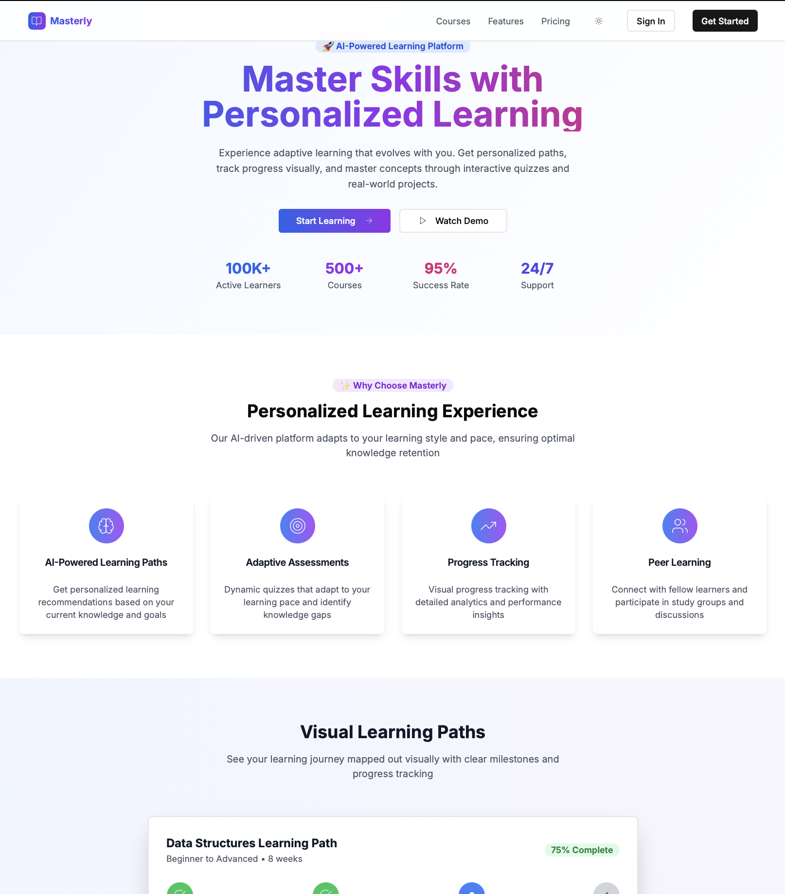

# 🚀 Masterly – Personalized Learning Platform

Masterly is a modern, fast, and interactive learning platform that offers personalized paths to master skills. Built with the MERN stack and tailored for developers and learners seeking structure and engagement.

🌐 **Access it live here:**: [Masterly](https://masterly-deploy-henna.vercel.app/)

## 🖼️ Homepage Preview

> _Here's a quick look at the Masterly homepage_


*Interactive UI*

---
## ✨ Features

### 🎯 **Core Learning Features**
- 🔐 **Secure Authentication** (Email/Password + Google OAuth)
- 🧠 **Interactive DSA Course** with video lectures, quizzes, and coding problems
- 📈 **User Progress Tracking** (concept-wise + topic-wise)
- 🎯 **Personalized dashboards** with statistics & quick actions
- 🧑‍🏫 **Instructor profiles** & course ratings
- 🗂️ **Modular & scalable course structure** (concepts → topics → content)

### 🧪 **Assessment & Testing**
- 📝 **Adaptive Quiz System** with anti-cheating measures
- 🎯 **Mock Tests** and **Course Assessments**
- ⏱️ **Timed Assessments** with real-time monitoring
- 📊 **Detailed Performance Analytics**
- 🔄 **Retake Options** with different question sets

### 💻 **Coding Platform**
- 🖥️ **Integrated Code Editor** with syntax highlighting
- 🐍 **Multi-language Support** (Python, Java, C++, JavaScript)
- ✅ **Automated Test Execution**
- 📋 **Problem-solving Interface**
- 🎯 **Real-time Code Validation**

### 📊 **Analytics & Insights**
- 📈 **Progress Visualization** with charts and graphs
- 🎯 **Learning Path Recommendations**
- 📊 **Performance Metrics** and mastery scores
- 📅 **Study Time Tracking**
- 🏆 **Achievement System** with badges and rewards

### 🤖 **AI-Powered Features**
- 🧠 **Personalized Learning Paths** based on user progress
- 🎯 **Adaptive Content Recommendations**
- 📚 **Smart Concept Sequencing**
- 🔍 **Intelligent Search** across courses and concepts
- 📈 **Predictive Analytics** for learning outcomes

### 👥 **Social & Collaboration**
- 👥 **Peer Learning** and study groups
- 💬 **Discussion Forums** for each course
- 🤝 **Mentor-Mentee Matching**
- 📢 **Community Challenges** and competitions
- 🏆 **Leaderboards** and rankings

---
## 🛠️ Tech Stack

| Tech                |      Purpose                     |
|---------------------|----------------------------------|
| **Next.js 15**      | App Router + React 19 support    |
| **Express.js**      | Backend API & Auth               |
| **MongoDB Atlas**   | Data storage (Courses, Users)    |
| **Mongoose**        | ODM for MongoDB                  |
| **Tailwind CSS**    | Styling and UI                   |
| **Zustand**         | Global state (auth)              |
| **Vercel + Render** | Deployment                       |
| **React 19**        | Frontend Framework (UI/UX)       |
| **TypeScript**      | Static typing, cleaner codebase  |
| **Radix UI**        | Accessible component library     |
| **OpenAI API**      | AI-powered recommendations       |
| **JWT + Passport**  | Authentication & authorization   |

---
## 🏗️ Architecture

### **Frontend Architecture**
```
Masterly/frontend/
├── app/                    # Next.js 15 App Router
│   ├── dashboard/         # User dashboard & analytics
│   ├── courses/          # Course browsing & enrollment
│   ├── quiz/             # Quiz platform & assessments
│   ├── coding-platform/  # Code editor & problems
│   ├── learning-paths/   # AI-generated learning paths
│   ├── admin/            # Admin panel
│   ├── auth/             # Authentication pages
│   └── [other routes]    # Profile, settings, help, etc.
├── components/           # Reusable UI components
│   ├── ui/              # Radix UI components (50+)
│   ├── quiz-platform.tsx # Advanced quiz system
│   ├── problem-solver.tsx # Coding interface
│   ├── DSAQuizEngine.tsx # DSA-specific quiz engine
│   └── [other components] # Sidebars, auth guards, etc.
├── lib/                 # Utilities & API client
├── hooks/               # Custom React hooks
└── [config files]       # Package.json, configs, etc.
```

### **Backend Architecture**
```
Masterly/backend/
├── src/
│   ├── models/          # MongoDB schemas (12 models)
│   │   ├── userModel.ts # Comprehensive user model
│   │   ├── courseModel.ts # Course & content model
│   │   └── [other models] # Progress, assessment, etc.
│   ├── routes/          # API endpoints (12 routes)
│   │   ├── authRoutes.ts # Authentication
│   │   ├── courseRoutes.ts # Course management
│   │   └── [other routes] # Quiz, admin, dashboard, etc.
│   ├── controllers/     # Business logic
│   ├── middlewares/     # Auth & validation
│   ├── config/          # Configuration files
│   └── utils/           # Helper functions
└── [config files]       # Package.json, scripts, etc.
```

---
## 🚀 Getting Started

### **Prerequisites**
- Node.js 18+ 
- MongoDB Atlas account
- OpenAI API key (for AI features)

### **Frontend Setup**
```bash
cd Masterly/frontend
npm install
npm run dev
```

### **Backend Setup**
```bash
cd Masterly/backend
npm install
npm run dev
```

### **Environment Variables**
```env
# Frontend (.env.local)
NEXT_PUBLIC_API_URL=http://localhost:5000

# Backend (.env)
MONGODB_URI=your_mongodb_connection_string
JWT_SECRET=your_jwt_secret
OPENAI_API_KEY=your_openai_api_key
GOOGLE_CLIENT_ID=your_google_oauth_client_id
```

---
## 📊 Database Schema

### **User Model**
- **Profile**: Personal info, avatar, bio, social links
- **Subscription**: Plan details, billing, payment methods
- **Stats**: Study time, progress, achievements, streaks
- **Preferences**: Learning settings, notifications, privacy
- **Enrollments**: Course progress, certificates, ratings

### **Course Model**
- **Content**: Title, description, instructor, pricing
- **Structure**: Concepts, topics, videos, articles
- **Stats**: Students, ratings, completion rates
- **Metadata**: Tags, requirements, learning outcomes

### **Assessment Model**
- **Quizzes**: Questions, answers, explanations
- **Tests**: Mock tests, course assessments
- **Progress**: User attempts, scores, time tracking
- **Analytics**: Performance metrics, mastery scores

---
## 🔒 Security Features

- **JWT Authentication** with secure token management
- **Google OAuth 2.0** integration
- **Password Hashing** with bcrypt
- **CORS Protection** with whitelisted origins
- **Input Validation** with express-validator
- **Anti-cheating Measures** in quiz platform
- **Rate Limiting** on API endpoints
- **Secure Cookie Management**

---
## 📈 Performance Optimizations

- **Next.js 15** with App Router for optimal routing
- **React 19** with concurrent features
- **MongoDB Indexing** for fast queries
- **Image Optimization** with Next.js Image component
- **Code Splitting** and lazy loading
- **CDN Integration** for static assets
- **Caching Strategies** for API responses

---
## 🧪 Testing & Quality

- **TypeScript** for type safety
- **ESLint** for code quality
- **Prettier** for code formatting
- **Input Validation** on all forms
- **Error Handling** with proper logging
- **API Testing** with comprehensive endpoints
- **UI Testing** with component isolation

---
## 🚀 Deployment

### **Frontend (Vercel)**
- Automatic deployments from Git
- Edge functions for API routes
- Global CDN for fast loading
- Environment variable management

### **Backend (Render)**
- Automatic scaling based on traffic
- Health checks and monitoring
- SSL certificate management
- Database connection pooling

---
## 📱 Mobile Responsiveness

- **Responsive Design** across all devices
- **Touch-friendly** interface elements
- **Progressive Web App** capabilities
- **Offline Support** for cached content
- **Mobile-optimized** quiz interface

---
## 👥 **Team Members**

This project was developed as part of our internship program. We worked collaboratively as a team to build this comprehensive learning platform:

### **Team Lead**
- **Ayush Singh** - ayushsinghtechcs@gmail.com

### **Development Team**
- **Abhinav Ranjan Sulabh** - abhinavranjan.dev@gmail.com
- **Ankit Pandey** - ankit211275@gmail.com
- **Titus George** - titusgeorge2004@gmail.com
- **Vedam Venkata Sarma** - venkatasarmavedam@gmail.com

### **What We Accomplished as a Team**
- 🏗️ **Full-Stack Development** - Built complete frontend and backend architecture
- 🎯 **Advanced Quiz System** - Implemented anti-cheating measures and real-time monitoring
- 💻 **Coding Platform** - Created integrated code editor with multi-language support
- 📊 **Analytics Dashboard** - Developed comprehensive progress tracking and insights
- 🤖 **AI Integration** - Implemented personalized learning paths and recommendations
- 🔐 **Security Features** - Built robust authentication and authorization system
- 📱 **Responsive Design** - Ensured seamless experience across all devices
- 🚀 **Deployment** - Successfully deployed on Vercel and Render platforms

---
## 🔮 Future Roadmap

### **Phase 1 (Completed by Our Team)**
- ✅ Core learning platform
- ✅ Quiz and assessment system
- ✅ Progress tracking
- ✅ Basic AI recommendations
- ✅ Coding platform with multi-language support
- ✅ Comprehensive dashboard and analytics
- ✅ Anti-cheating measures in quiz system
- ✅ Responsive design and mobile optimization

### **Phase 2 (Planned)**
- 🤖 **Advanced AI Tutor** with conversational interface
- 🎥 **Video Conferencing** for live sessions
- 📱 **Mobile App** development
- 🎮 **Gamification** with more achievements
- 💰 **Payment Integration** with Stripe

### **Phase 3 (Future)**
- 🌐 **Multi-language Support**
- 🎓 **Certification System**
- 🤝 **Enterprise Features**
- 📊 **Advanced Analytics Dashboard**
- 🔗 **API for Third-party Integrations**

---
## 📄 License

This project is licensed under the MIT License - see the LICENSE file for details.

---
## 📞 Support

- 📧 **Email**: support@masterly.com
- 💬 **Discord**: Join our community
- 📖 **Documentation**: Comprehensive guides
- 🐛 **Issues**: GitHub issue tracker

---
## Deployment links

🌐 **Live Frontend**: [https://masterly-deploy-henna.vercel.app/](https://masterly-deploy-henna.vercel.app/)  
🔗 **Live Backend API**: [https://masterly.onrender.com](https://masterly.onrender.com)

---
## 🏆 Acknowledgments

- **Next.js Team** for the amazing framework
- **Vercel** for seamless deployment
- **MongoDB** for reliable database
- **OpenAI** for AI capabilities
- **Radix UI** for accessible components
- **Tailwind CSS** for beautiful styling

---

*Built with ❤️ by the Masterly Team*

